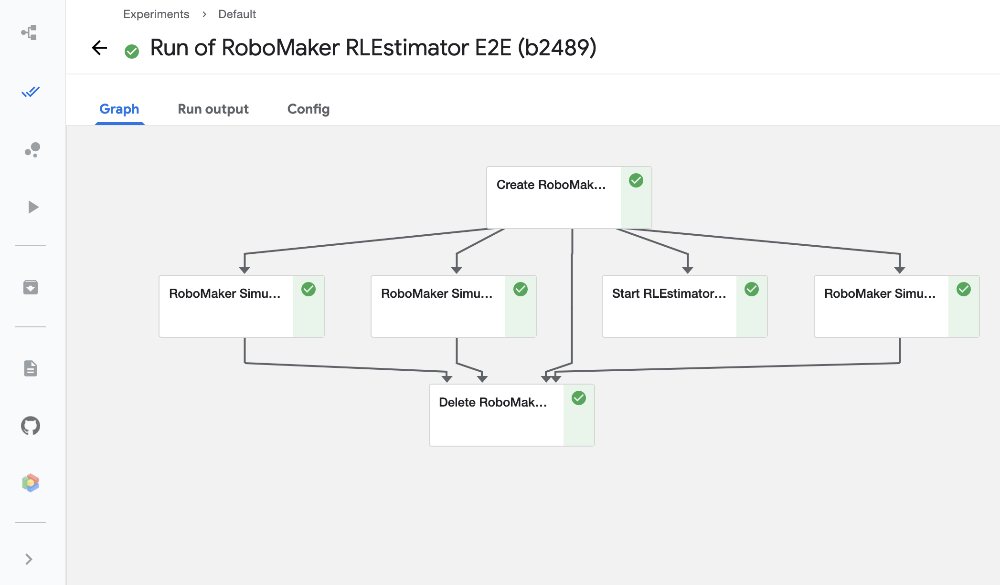
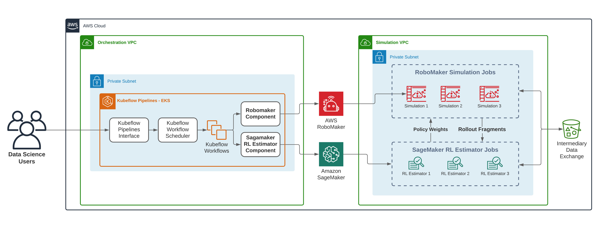

# kubeflow-pipelines-robomaker-examples

### Blog post: https://aws.amazon.com/

### Kubeflow Pipelines repo: https://github.com/kubeflow/pipelines

#### Configuration:
Prerequisites:
 - EKS Cluster running Kubeflow Pipelines
 - Private VPC with S3 and CloudWatch VPC Endpoints
 - S3 Bucket
 - A role with access to the S3 bucket, SageMakerFullAccess and RoboMakerFullAccess

#### Configuration:
You can edit the notebook to provide the subnets and security group of the VPC that you intend to run the RLEstimator
Training job and RoboMaker Simulation jobs in.

#### Steps

- Build components from URL
- Upload artifact files to S3
- Build the pipeline from the components
- Push the pipeline to KFP and run

## Pipeline running in KFP:

## Solution Architecture Design:

